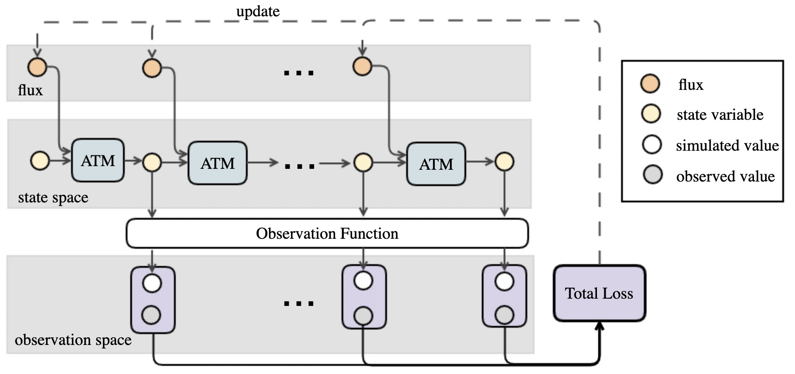
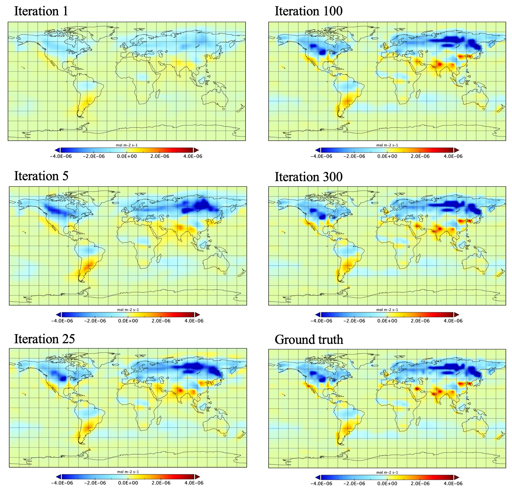

# PyTorch Implementation of PyATM

This library provides the implementation of a fully-differentiable atmosphere transport model called pyATM, which encoded the partial differential equations (PDEs) solver  into a computational graph based on a deep learning framework pytorch. The code is applied to our paper *An Automatic Differentiation Method for Surface Carbon Flux Inversion*.


## FrameWork

<p align="center">

</p>

The atmospheric transport model used in the inversion problem can be expressed as

$$ \frac{\partial \rho c}{\partial t} = -\nabla{(\rho c \cdot V)} + s $$

The equation describes the evolution of the carbon concentration field $c$ under the transport effect of meteorological velocity field $V$, and the source/sink effects of the surface flux $s$. $\rho$ is the density of the air which is constant by the incompressible flow assumption. The transport of the concentration field $c$ under the meteorological velocity field $V$,  the source and sink of the concentration is produced by the flux $s$, and $\rho$ is the density of the concentration. 


The Merra2 meteorological data used in this article can be accessed in this [repo](https://zenodo.org/record/7233948#.Y1PB6uxBxbU), which needs to be downloaded and unzip into the ./data/ folder. 

## Using PyATM in carbon inversion

Using the PyATM, we can run the atmospheric transport model, or to solve the inversion problem by  automatic differentiation.

The forward simulation can be run using the script"

```
./script/twin_forward.sh
```
```
python main.py \
--year 2019 \
--month 7 \
--day 1 \
--last_day 7 \
--interval_minutes 30 \
--device "cpu" \
--if_mixing_str "True" \
--sim_dimension 2 \
--layer_type "layer_1" \
--if_plot_result_str "True" \
--plot_interval 1 \
--data_folder './data/' \
--sub_data_folder "201907" \
--result_folder './result/twin_forward/' \
--geoschem_co2_file "GEOSChem.SpeciesConc.20190701_0000z.nc4" \
--flux_type "carbon_tracker" \
--flux_file_name "monthly_flux_np/CT2019B.flux1x1.201807_reshape.npy" \
--cinit_type "geos-chem" \
--problem_type "forward_simulation" \
--experiment_type "twin" \
--obs_type "full" 
```

<p align="center">

</p>


The inversion problem can be run using the script:
```
./script/twin_inversion.sh
```
```
python main.py \
--year 2019 \
--month 7 \
--day 1 \
--last_day 7 \
--interval_minutes 30 \
--device "cpu" \
--if_mixing_str "True" \
--sim_dimension 2 \
--layer_type "layer_1" \
--if_plot_result_str "True" \
--plot_interval 1 \
--data_folder './data/' \
--sub_data_folder "201907" \
--result_folder './result/twin_inversion/' \
--geoschem_co2_file "GEOSChem.SpeciesConc.20190701_0000z.nc4" \
--flux_type "carbon_tracker" \
--flux_file_name "monthly_flux_np/CT2019B.flux1x1.201807_reshape.npy" \
--cinit_type "geos-chem" \
--problem_type "inversion" \
--experiment_type "twin" \
--obs_type "full" \
--flux_type_inversion "init_constant" \
--iteration_number 300 \
--early_stop_value 0.1e-10 \
--lr_flux 1e-5
```
<p align="center">

</p>


